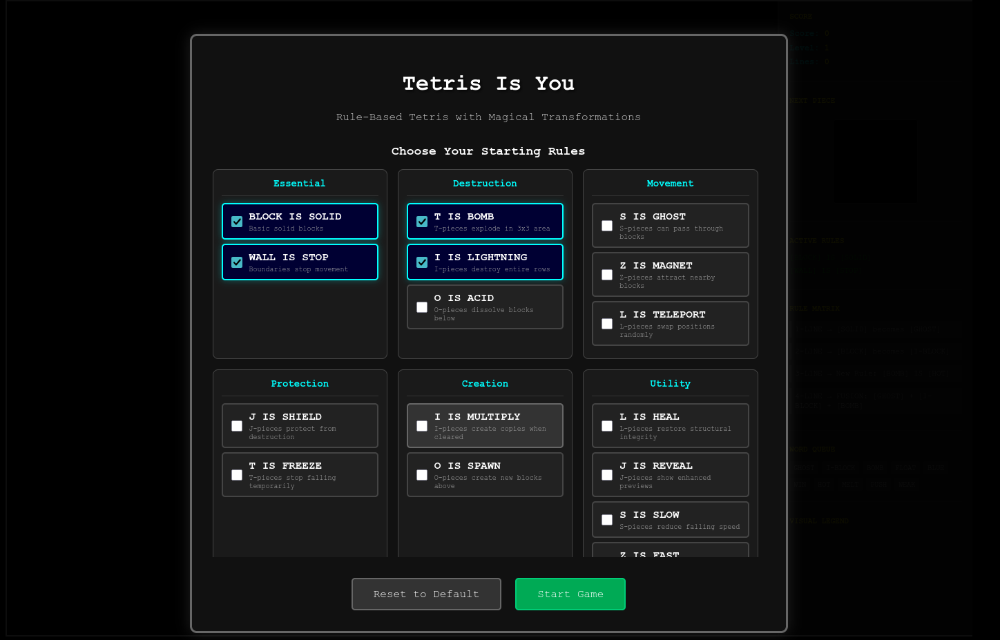
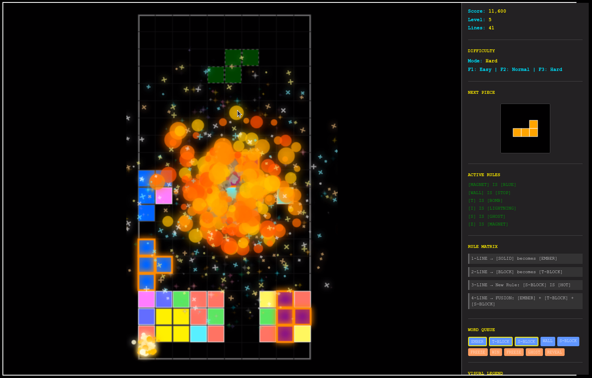
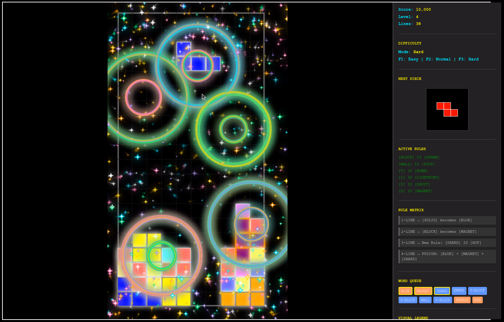
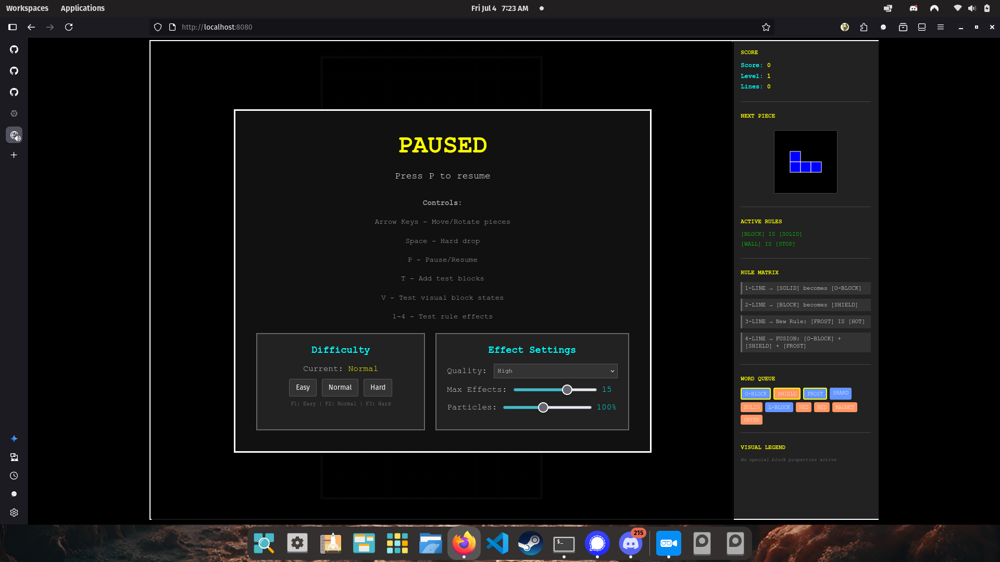

# Tetris Is You

A revolutionary rule-based Tetris game where the rules themselves become part of the gameplay. Inspired by "Baba Is You", this game transforms traditional Tetris into a dynamic puzzle experience where clearing lines creates new rules that change how the game behaves.

## 📸 Screenshots

### Start Menu & Rule Selection

*Choose your starting rules from an intuitive categorized interface*

### Gameplay with Visual Effects

*BOMB effects create stunning explosions with particle systems*

 
*MAGNET and other magical effects with colorful particle rings*

### Settings & Configuration

*In-game settings for difficulty and visual effects - accessible through pause menu*

## 🎮 Features

### Core Gameplay
- **Dynamic Rule System**: Clearing lines creates new rules that transform gameplay
- **20+ Effect Types**: BOMB explosions, LIGHTNING strikes, GHOST phases, and more
- **Visual Effects**: Stunning canvas-based particle effects for every spell
- **Enhanced Block Rendering**: 15+ distinctive visual states for rule-affected blocks
- **Progressive Difficulty**: Speed increases every 10 lines with configurable scaling

### User Interface
- **Interactive Start Menu**: Choose your starting rules from an intuitive categorized interface
- **Rule Selection**: 20+ available rules organized by category (Destruction, Movement, Protection, etc.)
- **Live Rule Display**: Real-time visualization of active rules and conflicts
- **Visual Legend**: Instant reference for all block appearances and effects
- **In-Game Settings**: Difficulty and effect settings accessible through pause menu
- **Effect Intensity Controls**: Real-time performance tuning with quality presets and sliders
- **Clean Layout**: Optimized 80/20 split with no scrollbars for distraction-free gameplay
- **Settings Persistence**: All configuration changes saved automatically

### Audio System
- **MIDI-Style Soundtrack**: Original ominous wizard-themed background music
- **Dynamic Sound Effects**: Audio feedback for every action (piece drops, explosions, rule formations)
- **Web Audio API**: Low-latency, high-quality audio synthesis
- **Volume Controls**: Independent music and SFX volume control
- **Satisfying "Plop" Sound**: Gentle, realistic piece landing audio

### Configuration System
- **Multiple Difficulty Levels**: Easy, Normal, and Hard configurations
- **JSON-Based Config**: Easily customizable game settings
- **Runtime Switching**: Change difficulty with F1/F2/F3 keys
- **Persistent Settings**: User preferences saved to localStorage
- **Comprehensive Documentation**: Full configuration guide in CONFIG.md

## 🚀 Quick Start

1. **Clone the repository**
   ```bash
   git clone <repository-url>
   cd tetris-is-you
   ```

2. **Install dependencies**
   ```bash
   npm install
   ```

3. **Build the project**
   ```bash
   npm run build
   ```

4. **Open in browser**
   - Open `index.html` in your web browser
   - Or serve locally: `python -m http.server 8000`

## 🎯 How to Play

### Basic Controls
- **Arrow Keys**: Move and rotate pieces
- **Space**: Hard drop
- **P**: Pause/Resume (access settings)
- **R**: Restart game (when game over)
- **F1/F2/F3**: Quick difficulty switching (Easy/Normal/Hard)
- **Escape**: Return to start menu

### Rule System
1. **Select Starting Rules**: Choose your initial rule set from the start menu
2. **Clear Lines**: Clearing lines consumes words from the queue to create new rules
3. **Watch Transformations**: Rules change how blocks behave (BOMB explodes, GHOST phases through)
4. **Strategic Planning**: Plan your moves considering active rules and their interactions

### Settings & Performance
- **Pause Menu Access**: Press **P** to access difficulty and effect settings during gameplay
- **Effect Quality**: Choose from Low/Medium/High/Ultra presets for optimal performance
- **Performance Tuning**: Adjust max concurrent effects (5-20) and particle density (20%-200%)
- **Real-time Updates**: All settings changes apply immediately without restarting
- **Auto-save**: Settings persist between game sessions

### Available Effects

#### Destruction Effects
- **BOMB**: Explodes in 3x3 area when line cleared
- **LIGHTNING**: Destroys entire row when triggered
- **ACID**: Dissolves blocks below, can spread horizontally

#### Movement Effects
- **GHOST**: Pieces can pass through these blocks
- **MAGNET**: Pulls nearby blocks toward it
- **TELEPORT**: Randomly swaps positions with other blocks

#### Protection Effects
- **SHIELD**: Protects from all destruction effects
- **FREEZE**: Stops piece falling temporarily

#### Creation Effects
- **MULTIPLY**: Creates copies when line cleared
- **SPAWN**: Creates new blocks above it every 5 seconds

#### Utility Effects
- **HEAL**: Restores structural integrity nearby
- **REVEAL**: Shows enhanced next piece preview
- **SLOW/FAST**: Modifies falling speed
- **MELT**: Blocks disappear after 10 seconds

## 🛠️ Technical Architecture

### Core Systems
- **TypeScript**: Full type safety and modern JavaScript features
- **Canvas Rendering**: High-performance 2D graphics with custom effects
- **Web Audio API**: Real-time audio synthesis and mixing
- **Modular Design**: Clean separation of concerns across multiple classes

### Key Components
- **Game.ts**: Main game loop and initialization
- **GameLogic.ts**: Core gameplay mechanics and rule application
- **RuleEngine.ts**: Dynamic rule creation and conflict resolution
- **AudioSystem.ts**: MIDI-style audio synthesis and playback
- **StartMenu.ts**: Interactive rule selection interface
- **EffectManager.ts**: Particle effects and visual enhancements

### Configuration
- **JSON-based settings**: Easy customization without code changes
- **Multiple presets**: Easy, Normal, and Hard difficulty configurations
- **Runtime flexibility**: Change settings during gameplay
- **Validation system**: Ensures configuration integrity

## 📁 Project Structure

```
tetris-is-you/
├── src/                    # TypeScript source code
│   ├── effects/           # Visual effect classes
│   ├── Game.ts           # Main game class
│   ├── GameLogic.ts      # Core gameplay mechanics
│   ├── RuleEngine.ts     # Rule system implementation
│   ├── AudioSystem.ts    # Audio synthesis system
│   └── StartMenu.ts      # Menu interface
├── config/                # Game configuration files
│   ├── easy-config.json  # Easy difficulty settings
│   ├── game-config.json  # Normal difficulty settings
│   └── hard-config.json  # Hard difficulty settings
├── dist/                  # Compiled JavaScript output
├── assets/               # Generated game assets
├── docs/                 # Documentation and specifications
├── index.html           # Main game page
└── CONFIG.md           # Configuration guide
```

## 🎨 Asset Generation

The project includes Python scripts for generating visual assets:
- **ComfyUI Integration**: Automated asset generation pipeline
- **Batch Processing**: Generate multiple asset variations
- **Consistent Styling**: Maintains visual coherence across all assets

## 📖 Documentation

- **CONFIG.md**: Comprehensive configuration guide
- **AUDIO_ASSET_SPECIFICATION.md**: Audio system specifications
- **VISUAL_ASSET_SPECIFICATION.md**: Visual asset requirements
- **TEST_PLAN.md**: Testing strategy and procedures

## 🔧 Development

### Building
```bash
npm run build
```

### Development Server
```bash
# Serve locally for testing
python -m http.server 8000
# Or use any static file server
```

### Code Style
- TypeScript with strict type checking
- Modular class-based architecture
- Comprehensive error handling
- Performance-optimized rendering

## 🎵 Audio Features

### Soundtrack
- Original MIDI composition with ominous wizard atmosphere
- 19-second looping track with melodic progression
- Dynamic bass lines and atmospheric triangle waves

### Sound Effects
- **Piece Drop**: Satisfying "wet plop" with frequency sweep
- **Line Clear**: Triumphant crystalline chimes
- **BOMB Explosion**: Dramatic rumbling explosion
- **Rule Formation**: Magical crystalline feedback
- **Menu Interactions**: Subtle click and success sounds

## 🚀 Future Enhancements

- **Multiplayer Support**: Local and online competitive modes
- **Level Editor**: Custom rule set creation tools
- **Achievement System**: Progress tracking and unlockables
- **Mobile Support**: Touch-optimized controls
- **Advanced AI**: Computer opponents with different strategies

## 📄 License

This project is licensed under the MIT License - see the LICENSE file for details.

## 🤝 Contributing

Contributions are welcome! Please feel free to submit a Pull Request. For major changes, please open an issue first to discuss what you would like to change.

## 🙏 Acknowledgments

- Inspired by "Baba Is You" by Hempuli Oy
- Classic Tetris by Alexey Pajitnov
- Web Audio API community for synthesis techniques
- TypeScript team for excellent developer experience

---

**Enjoy playing Tetris Is You!** 🎮✨